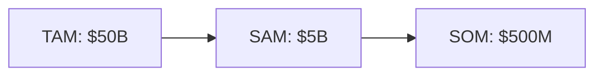
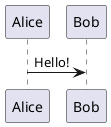

# Slidev Standards and Best Practices for AI-Driven Slide Generation

**Task**: 345 - Port /deck command-skill-agent from Typst to Slidev
**Started**: 2026-03-31T14:00:00Z
**Completed**: 2026-03-31T15:30:00Z
**Effort**: Large
**Dependencies**: 01_slidev-port-research.md
**Sources/Inputs**: Slidev official docs (sli.dev/guide/*), Slidev AI skill repository (github.com/slidevjs/slidev/tree/main/skills/slidev), 51 reference files
**Artifacts**: specs/345_port_deck_typst_to_slidev/reports/02_slidev-standards.md
**Standards**: report-format.md, subagent-return.md

---

## Executive Summary

- Slidev's markdown syntax is straightforward but has strict structural rules (separator format, frontmatter scoping, slot syntax) that an AI agent must follow precisely
- The official Slidev AI skill repository contains 51 reference files organized by category; the most critical for pitch deck generation are core-syntax, core-headmatter, core-frontmatter, core-layouts, core-animations, core-components, and core-exporting
- Layout selection for pitch decks maps cleanly to ~6 of the 20 built-in layouts: cover, default, center, two-cols, fact, statement, and end
- Typography enforcement must shift from Typst point sizes to CSS/scoped styles with equivalent rem/em values
- Export to PDF requires playwright-chromium; the non-blocking pattern from the current Typst system transfers directly

---

## A. Slide Syntax Standards

### A.1 File Structure

A Slidev presentation is a single markdown file (conventionally `slides.md`) with this structure:

```markdown
---
<headmatter: deck-wide YAML configuration>
---

# First slide content

---

# Second slide content

---
layout: center
---

# Third slide with per-slide frontmatter
```

### A.2 Slide Separators

**Rule**: Slides are separated by `---` on its own line.

**Critical**: The separator `---` MUST have content or blank lines around it. Consecutive `---` blocks are interpreted as frontmatter delimiters, not multiple separators.

```markdown
# Slide 1 content here

---

# Slide 2 content here
```

### A.3 Headmatter (Deck-Wide Configuration)

The **first** frontmatter block in the file is the "headmatter" -- it configures the entire presentation, not just the first slide.

**Essential headmatter properties for pitch decks**:

```yaml
---
theme: seriph                    # Theme package name
title: "Company Name"            # Deck title (used in OG tags, PDF metadata)
author: "Founder Name"           # Author name
info: "Investor Pitch Deck"      # Description
aspectRatio: "16/9"              # Aspect ratio (default: 16/9)
canvasWidth: 980                 # Canvas width in px (default: 980)
colorSchema: dark                # Color mode: auto | light | dark
fonts:
  sans: Inter                    # Primary sans-serif font
  serif: Montserrat              # Serif font (used for headers via CSS)
  mono: Fira Code                # Monospace font
transition: slide-left           # Default slide transition
defaults:
  layout: default                # Default layout for all slides
themeConfig:
  primary: '#5d8392'             # Theme primary color
exportFilename: company-deck     # Export filename (no extension)
download: true                   # Enable PDF download button in built version
---
```

**Full headmatter property catalog**:

| Property | Type | Default | Description |
|----------|------|---------|-------------|
| `theme` | string | `default` | Theme name or path |
| `title` | string | `Slidev` | Presentation title |
| `author` | string | - | Author name |
| `info` | string | - | Description for OG/meta |
| `aspectRatio` | string | `16/9` | Canvas aspect ratio |
| `canvasWidth` | number | `980` | Canvas width in pixels |
| `colorSchema` | string | `auto` | `auto`, `light`, or `dark` |
| `fonts` | object | - | Font configuration (`sans`, `serif`, `mono`) |
| `transition` | string/object | - | Default slide transition |
| `defaults` | object | - | Default frontmatter for all slides |
| `themeConfig` | object | - | Theme-specific configuration |
| `addons` | array | `[]` | Addon packages to load |
| `lineNumbers` | boolean | `false` | Show line numbers in code blocks globally |
| `exportFilename` | string | - | Filename for exports |
| `download` | boolean | `false` | Enable download button in built SPA |
| `highlighter` | string | `shiki` | Code highlighter engine |
| `comark` | boolean | `false` | Enable Comark/MDC syntax |

### A.4 Per-Slide Frontmatter

Individual slides can have their own YAML frontmatter block immediately after a `---` separator:

```yaml
---
layout: two-cols
background: /images/bg.jpg
backgroundSize: cover
class: text-white
transition: fade
clicks: 5
clicksStart: 0
zoom: 1
hide: false
hideInToc: false
level: 2
title: Custom Title
preload: false
---
```

**Key properties**:

| Property | Type | Description |
|----------|------|-------------|
| `layout` | string | Layout component name |
| `background` | string | Background image URL |
| `backgroundSize` | string | CSS background-size |
| `class` | string | CSS classes applied to slide |
| `transition` | string/object | Slide transition override |
| `clicks` | number | Total number of clicks on slide |
| `clicksStart` | number | Starting click number |
| `zoom` | number | Content scale factor (0.8 = 80%) |
| `hide`/`disabled` | boolean | Hide slide from presentation |
| `hideInToc` | boolean | Exclude from table of contents |
| `level` | number | Heading hierarchy level |
| `title` | string | Override slide title |
| `src` | string | Import external markdown file |
| `image` | string | Image URL for image layouts |
| `url` | string | URL for iframe layouts |

**Frontmatter merging rule**: When importing slides via `src`, the main entry's frontmatter takes precedence over the imported file's for duplicate keys.

### A.5 Named Slots (Slot Sugar)

Multi-column layouts use `::slotname::` syntax to divide content into named regions:

```markdown
---
layout: two-cols
---

# Left Column Content

This appears on the left side.

::right::

# Right Column Content

This appears on the right side.
```

**Available slot markers by layout**:

| Layout | Slots |
|--------|-------|
| `two-cols` | `default` (left), `::right::` |
| `two-cols-header` | `default` (header), `::left::`, `::right::` |
| `image-left` | `default` (right content area) |
| `image-right` | `default` (left content area) |
| `iframe-left` | `default` (right content area) |
| `iframe-right` | `default` (left content area) |

**Rule**: `::default::` can be used explicitly to reorder slots. Content before any `::slotname::` marker goes into the default slot.

### A.6 Presenter Notes

HTML comments at the end of a slide become presenter notes:

```markdown
# My Slide Title

Content here.

<!--
Speaker notes go here.
- Supports **markdown** formatting
- Multiple lines OK
-->
```

**Rule**: Notes MUST be HTML comments. They MUST appear at the end of the slide (after all content). Markdown and HTML rendering is supported within notes.

**Click markers in notes**: Use `[click]` and `[click:N]` markers within presenter notes to synchronize note highlighting with click animations:

```markdown
<!--
Introduction paragraph shown immediately.

[click] This section highlights after the first click.

[click:3] This highlights at click 3 (skipping click 2).
-->
```

### A.7 Slide Importing

External markdown files can be imported as slides:

```yaml
---
src: ./pages/intro.md
---
```

Selective importing with slide ranges:

```yaml
---
src: ./other-presentation.md#2,5-7
---
```

### A.8 Block Frontmatter (Alternative Syntax)

Per-slide frontmatter can alternatively be written as a YAML code block at the start of a slide (provides syntax highlighting in editors):

````markdown
```yaml
layout: quote
```

> This is a quote slide
````

**Rule**: Block frontmatter works for per-slide frontmatter only, NOT headmatter.

---

## B. Layout Selection Guide

### B.1 All 20 Built-In Layouts

| Layout | Purpose | Key Props/Slots | Pitch Deck Usage |
|--------|---------|-----------------|------------------|
| `default` | Standard content slide | - | Problem, Solution, Business Model, Market |
| `center` | Horizontally and vertically centered | - | The Ask, key statements |
| `cover` | Title/cover slide (auto for slide 1) | - | Title slide |
| `intro` | Introduction slide | - | Alternate title |
| `end` | Final/closing slide | - | Closing/contact |
| `section` | Section divider | - | Section breaks (if needed) |
| `quote` | Large quotation display | - | Customer testimonials |
| `statement` | Bold assertion/affirmation | - | Problem statement, Why Now |
| `fact` | Data/statistic prominence | - | Traction metrics |
| `full` | Full screen, no padding | - | Full-bleed images |
| `none` | Blank canvas, no styling | - | Custom layouts via CSS |
| `two-cols` | Two columns | `default` (left), `::right::` | Solution features, Team, Why Us |
| `two-cols-header` | Header + two columns below | `default`, `::left::`, `::right::` | Comparison slides |
| `image` | Full-screen background image | `image`, `backgroundSize` | Visual impact slides |
| `image-left` | Image left, content right | `image`, `class` | Product showcase |
| `image-right` | Image right, content left | `image`, `class` | Product showcase |
| `iframe` | Full-screen embedded page | `url` | Live demos |
| `iframe-left` | Iframe left, content right | `url`, `class` | Demo + explanation |
| `iframe-right` | Iframe right, content left | `url`, `class` | Demo + explanation |

### B.2 Pitch Deck Slide-to-Layout Mapping

| Pitch Deck Slide | Recommended Layout | Rationale |
|------------------|--------------------|-----------|
| 1. Title | `cover` | Auto-applied for slide 1; centered title treatment |
| 2. Problem | `statement` or `default` | Statement for bold single-idea; default for bulleted pain points |
| 3. Solution | `two-cols` or `default` | Two-cols for feature/benefit split; default for narrative |
| 4. Traction | `fact` or `default` | Fact layout emphasizes metrics prominently |
| 5. Why Us/Now | `two-cols` | Natural split between "why us" and "why now" |
| 6. Business Model | `default` | Structured content with pricing/economics |
| 7. Market (TAM/SAM/SOM) | `default` | Market sizing with optional Mermaid diagram |
| 8. Team | `two-cols` | Founder bios side by side |
| 9. The Ask | `center` or `statement` | Prominent, centered ask amount and milestones |
| 10. Closing | `end` | Built-in closing treatment |

### B.3 Layout Resolution Order

Layouts load in priority order (last wins):
1. Slidev default built-in layouts
2. Theme-provided layouts
3. Addon layouts
4. Custom layouts in `./layouts/` directory

### B.4 Custom Layouts

Custom layouts are Vue components in the `layouts/` directory:

```
project/
├── slides.md
└── layouts/
    └── my-layout.vue
```

Custom layouts use `<slot />` for default content and named slots (e.g., `<slot name="top" />`). Referenced via frontmatter: `layout: my-layout`.

---

## C. Animation Best Practices

### C.1 v-click (Progressive Reveal)

**Directive form**: `<div v-click>Appears on next click</div>`

**Component form**: `<v-click>Appears on next click</v-click>`

**Positioning**:
- Relative (default): `v-click` or `v-click="'+1'"` -- each increments click count
- Absolute: `v-click="3"` -- appears at exactly click 3
- Range: `v-click="[2,5]"` -- visible during clicks 2-4

**Hide modifier**: `v-click.hide` -- element starts visible, hides on click

```markdown
<div v-click>First point</div>
<div v-click>Second point</div>
<div v-click.hide="[3, 5]">Visible except during clicks 3-4</div>
```

### C.2 v-after

Shows content simultaneously with the previous v-click (equivalent to `v-click="'+0'"`):

```markdown
<div v-click>Hello</div>
<div v-after>World</div>  <!-- appears at same time as "Hello" -->
```

### C.3 v-clicks (Bulk Progressive Reveal)

Applies v-click to all children. Essential for revealing bullet lists one item at a time:

```markdown
<v-clicks>

- First bullet (click 1)
- Second bullet (click 2)
- Third bullet (click 3)

</v-clicks>
```

**Props**:
- `depth="2"` -- apply to nested list items too
- `every="2"` -- reveal 2 items per click

### C.4 v-switch (Multi-State Content)

Display different content at different click states:

```markdown
<v-switch>
  <template #1>Content at click 1</template>
  <template #2>Content at click 2</template>
  <template #5-7>Content at clicks 5-6</template>
</v-switch>
```

### C.5 v-motion (CSS Animations)

Powered by @vueuse/motion. Animates element properties on slide entry and clicks:

```html
<div v-motion
  :initial="{ x: -80, opacity: 0 }"
  :enter="{ x: 0, opacity: 1 }"
  :click-1="{ x: 0, y: 30 }"
  :click-2="{ y: 60 }">
  Animated content
</div>
```

**Variants**: `:initial`, `:enter`, `:leave`, `:click-1`, `:click-2`, `:click-2-4` (range)

### C.6 Slide Transitions

**Built-in types**: `fade`, `fade-out`, `slide-left`, `slide-right`, `slide-up`, `slide-down`, `view-transition`

**Configuration** (per-slide or global):

```yaml
---
transition: slide-left
---
```

**Bidirectional** (forward | backward):

```yaml
---
transition: slide-left | slide-right
---
```

**Custom transitions** via CSS classes:

```css
.my-transition-enter-active,
.my-transition-leave-active {
  transition: opacity 0.5s ease;
}
.my-transition-enter-from,
.my-transition-leave-to {
  opacity: 0;
}
```

### C.7 v-mark (Hand-Drawn Annotations)

Powered by Rough Notation. Adds hand-drawn emphasis:

**Types**: `underline`, `circle`, `highlight`, `strike-through`, `box`

```html
<span v-mark.underline>Important</span>
<span v-mark.circle>Key metric</span>
<span v-mark.highlight>Highlighted text</span>
<span v-mark="{ color: '#e74c3c', type: 'circle' }">Custom</span>
```

**Click timing**: `v-mark="5"` (at click 5), `v-mark="'+1'"` (next click)

**Colors**: `.red`, `.blue` presets, or custom via `{ color: '#hex' }`

### C.8 CSS Classes for Click State

| Class | Applied When |
|-------|-------------|
| `.slidev-vclick-target` | Element is a click target |
| `.slidev-vclick-hidden` | Element is currently hidden |
| `.slidev-vclick-current` | Element is the active click target |
| `.slidev-vclick-prior` | Element was previously revealed |

Default hidden style: `opacity: 0; pointer-events: none;` with 100ms transition.

### C.9 Pitch Deck Animation Guidelines

**DO**:
- Use `<v-clicks>` for bullet point lists to reveal one at a time
- Use `v-mark.highlight` to emphasize key metrics on traction slides
- Use `fade` or `slide-left` transitions between slides for professional feel
- Set `clicks` frontmatter to control total click count per slide

**DO NOT**:
- Over-animate -- pitch decks should be simple (per YC design principles)
- Use `v-motion` for decorative effects on investor decks
- Add transitions that slow down the presentation flow
- Use more than 3-4 clicks per slide maximum

---

## D. Theme Configuration

### D.1 Using Themes

Themes are npm packages configured in headmatter:

```yaml
---
theme: seriph
---
```

**Name conventions**:
- Shorthand: `seriph` (resolves to `@slidev/theme-seriph`)
- Full package: `slidev-theme-my-custom`
- Scoped: `@org/slidev-theme-name` (requires full name)
- Local path: `../my-theme`

**Auto-installation**: Slidev prompts to install missing themes on dev server start.

### D.2 Official Themes

Key themes for pitch decks:
- `default` -- Minimal, clean
- `seriph` -- Professional, serif-accented (RECOMMENDED for pitch decks)
- `apple-basic` -- Apple-style minimalism
- `bricks` -- Modern geometric
- `dracula` -- Dark theme

### D.3 Theme Configuration

Theme-specific options via `themeConfig`:

```yaml
---
theme: seriph
themeConfig:
  primary: '#5d8392'
---
```

### D.4 Color Schema

```yaml
---
colorSchema: dark    # dark | light | auto
---
```

### D.5 Fonts

```yaml
---
fonts:
  sans: Inter              # Primary sans-serif
  serif: Montserrat        # Serif font
  mono: Fira Code          # Monospace
  provider: google         # Font provider: google | none
---
```

**Pitch deck typography mapping** (Typst -> Slidev):

| Typst | Slidev Equivalent |
|-------|-------------------|
| Montserrat 48pt H1 | `fonts.serif: Montserrat` + scoped CSS `h1 { font-size: 3em; font-family: 'Montserrat'; }` |
| Montserrat 40pt H2 | Scoped CSS `h2 { font-size: 2.5em; font-family: 'Montserrat'; }` |
| Inter 32pt body | `fonts.sans: Inter` (automatic body font) |
| 20pt minimum | Scoped CSS enforcement |

### D.6 Theme Ejection

Extract an installed theme for full customization:

```bash
slidev theme eject
```

Creates a local `theme/` directory with all theme files for modification.

### D.7 Addons

Additional functionality via addon packages:

```yaml
---
addons:
  - excalidraw
  - '@slidev/plugin-notes'
---
```

Addons can provide styles, components, layouts, and configuration. Multiple addons can be combined.

---

## E. Component Reference

### E.1 Built-In Components

All components auto-import (no manual import needed).

**Navigation**:

| Component | Props | Usage |
|-----------|-------|-------|
| `<Link>` | `to` (slide number or route alias) | `<Link to="5">Slide 5</Link>` |
| `<SlideCurrentNo />` | - | Current slide number |
| `<SlidesTotal />` | - | Total slide count |
| `<Toc />` | `columns`, `maxDepth`, `minDepth`, `mode` | Table of contents |
| `<TitleRenderer />` | `no` (slide number) | Render specific slide title |

**Layout/Sizing**:

| Component | Props | Usage |
|-----------|-------|-------|
| `<AutoFitText>` | `max`, `min`, `modelValue` | Auto-scaling text for metrics |
| `<Transform>` | `scale`, `origin` | Scale content: `<Transform :scale="0.5">` |

**Media**:

| Component | Props | Usage |
|-----------|-------|-------|
| `<SlidevVideo>` | `controls`, `autoplay`, `autoreset`, `poster`, `timestamp` | Video player |
| `<Youtube>` | `id`, `width`, `height` | YouTube embed |
| `<Tweet>` | `id`, `scale` | Twitter embed |

**Drawing**:

| Component | Props | Usage |
|-----------|-------|-------|
| `<Arrow>` | `x1`, `y1`, `x2`, `y2`, `width`, `color`, `two-way` | Line/arrow |
| `<VDragArrow>` | - | Interactive draggable arrow |

**Conditional**:

| Component | Props/Slots | Usage |
|-----------|-------------|-------|
| `<LightOrDark>` | `#dark`, `#light` slots | Theme-conditional content |
| `<RenderWhen>` | context (presenter, print, overview) | Context-conditional rendering |

**Pitch deck favorites**:
- `<AutoFitText>` -- Essential for traction metrics that need to scale to fill available space
- `<Arrow>` -- Visual connectors on architecture or flow slides
- `<Transform>` -- Scale down large content to fit

### E.2 Custom Components

Place Vue components in `./components/` for auto-import:

```
project/
├── slides.md
└── components/
    └── MetricCard.vue
```

Usage in slides: `<MetricCard value="$2.5M" label="ARR" />`

---

## F. Code Block Features

### F.1 Line Highlighting

**Static**: Highlight specific lines:

```markdown
```ts {2,3}
function add(a: number, b: number) {
  return a + b  // highlighted
}              // highlighted
```
```

**Click-based**: Progressive highlighting with `|`:

```markdown
```ts {2-3|5|all}
function add(
  a: Ref<number>,     // click 1: lines 2-3 highlighted
  b: Ref<number>
) {
  return computed(() => unref(a) + unref(b))  // click 2: line 5
}  // click 3: all lines
```
```

**Special keywords**: `hide` (concealed), `none` (no highlight), `all` (everything), `{*}` (placeholder)

### F.2 Line Numbers

**Global**: `lineNumbers: true` in headmatter

**Per-block**: `{lines:true}` and `{startLine:5}`:

```markdown
```ts {6,7}{lines:true,startLine:5}
// Line numbers start at 5
```
```

### F.3 Max Height (Scrollable Code)

```markdown
```ts {*}{maxHeight:'200px'}
// Long code block with scrolling
```
```

### F.4 Monaco Editor

**Read-only**: `{monaco}` -- embedded VS Code editor:

```markdown
```ts {monaco}
console.log('Interactive editor')
```
```

**Runnable**: `{monaco-run}` -- execute code in browser

**Writable**: `{monaco-write}` -- edits saved to file

### F.5 Shiki Magic Move

Animated code transitions between states (4 backticks wrapper):

`````markdown
````md magic-move
```js
console.log('Step 1')
```
```js
console.log('Step 2')
```
````
`````

Supports click timing: `{at:4, lines: true}` and per-step line highlighting.

### F.6 TwoSlash

TypeScript type annotations inline:

```markdown
```ts twoslash
const msg = 'hello'
//    ^?
```
```

### F.7 Code Groups (Requires Comark)

Tabbed code blocks (requires `comark: true`):

```markdown
::code-group

```npm [npm]
npm install slidev
```

```yarn [yarn]
yarn add slidev
```

::
```

### F.8 Code Import

Import from external files:

```markdown
<<< @/snippets/example.ts
<<< @/snippets/example.ts#region-name
<<< @/snippets/example.ts{2,3}
```

---

## G. Diagram Integration

### G.1 Mermaid

Inline diagrams via code blocks:

````markdown

````

**Configuration**: `{theme: 'neutral', scale: 0.8}`

**Supported types**: flowchart, sequenceDiagram, classDiagram, stateDiagram, erDiagram, gantt, pie

**Pitch deck usage**: Market sizing visualization (TAM/SAM/SOM), business model flows, user journey maps.

### G.2 PlantUML

````markdown

````

**Server config**: `plantUmlServer: https://www.plantuml.com/plantuml` in headmatter.

### G.3 LaTeX (KaTeX)

**Inline**: `$E = mc^2$`

**Block**:

```markdown
$$
\begin{aligned}
\text{Revenue} &= \text{Users} \times \text{ARPU} \\
\text{LTV} &= \frac{\text{ARPU}}{\text{Churn Rate}}
\end{aligned}
$$
```

**Line highlighting**: `$$ {1|3|all}` for progressive equation reveal.

**Chemical equations**: Supported via mhchem extension.

---

## H. Export and Build

### H.1 CLI Commands

```bash
# Development server
slidev [slides.md]              # Start dev server (default port 3030)
slidev --port 8080              # Custom port

# Build to SPA
slidev build                    # Output to dist/
slidev build --download         # Include PDF download

# Export
slidev export                           # PDF (default)
slidev export --format pptx             # PowerPoint
slidev export --format png              # PNG per slide
slidev export --format md               # Clean markdown

# Format
slidev format [slides.md]               # Auto-format markdown
```

### H.2 Export Options

| Option | Description | Default |
|--------|-------------|---------|
| `--output <file>` | Output filename | `slides-export.pdf` |
| `--format <fmt>` | `pdf`, `pptx`, `png`, `md` | `pdf` |
| `--with-clicks` | Export each click step as page | `false` |
| `--dark` | Export in dark mode | `false` |
| `--omit-background` | Remove backgrounds | `false` |
| `--range <range>` | Slide range: `1,4-7,10` | all |
| `--with-toc` | Generate clickable PDF outline | `false` |
| `--timeout <ms>` | Render timeout per slide | `30000` |
| `--wait <ms>` | Wait before capture | `0` |
| `--per-slide` | One render per slide (for global layers) | `false` |
| `--executable-path` | Custom browser path | system default |

### H.3 Headmatter Export Config

```yaml
---
exportFilename: company-pitch-deck
download: true
export:
  format: pdf
  timeout: 30000
  withClicks: false
---
```

### H.4 Prerequisites

PDF/PNG/PPTX export requires playwright-chromium:

```bash
npx playwright install chromium
```

**Pitch deck non-blocking pattern**: Export failure should not block task completion. The `.md` output is always valid. PDF is optional.

### H.5 Build for Hosting

```bash
slidev build              # Output: dist/
```

Produces a static SPA deployable to any static host. Add `--download` to include PDF download button.

---

## I. Global Context API

### I.1 Template Variables

Available in slide markdown and Vue components:

| Variable | Type | Description |
|----------|------|-------------|
| `$page` | number | Current page (1-indexed) |
| `$nav` | object | Navigation state and controls |
| `$slidev` | object | Project and theme config |
| `$frontmatter` | object | Current slide's frontmatter |
| `$clicks` | number | Current click count |
| `$renderContext` | string | `'slide'`, `'overview'`, `'presenter'`, `'previewNext'` |

### I.2 Navigation Object ($nav)

| Property/Method | Type | Description |
|-----------------|------|-------------|
| `$nav.currentPage` | number | Active slide number |
| `$nav.currentLayout` | string | Active layout name |
| `$nav.total` | number | Total slides |
| `$nav.isPresenter` | boolean | Presenter mode flag |
| `$nav.next()` | function | Next click |
| `$nav.prev()` | function | Previous click |
| `$nav.nextSlide()` | function | Next slide |
| `$nav.prevSlide()` | function | Previous slide |
| `$nav.go(n)` | function | Jump to slide n |

### I.3 Composables

Import from `@slidev/client`:

| Composable | Purpose |
|------------|---------|
| `useNav()` | Programmatic navigation |
| `useDarkMode()` | Dark/light toggle |
| `useIsSlideActive()` | Reactive active state |
| `useSlideContext()` | Access $page, $clicks, $frontmatter |

### I.4 Lifecycle Hooks

**Use these instead of Vue's `onMounted`/`onUnmounted`** (slides persist in DOM):

| Hook | When |
|------|------|
| `onSlideEnter()` | Slide becomes active |
| `onSlideLeave()` | Slide becomes inactive |

### I.5 Global Layers

Persistent components across all slides:

| File | Purpose | Scope |
|------|---------|-------|
| `global-top.vue` | Above all slides | Single instance |
| `global-bottom.vue` | Below all slides | Single instance |
| `slide-top.vue` | Above each slide | Per-slide instance |
| `slide-bottom.vue` | Below each slide | Per-slide instance |
| `custom-nav-controls.vue` | Custom nav controls | Single instance |

**Z-order** (top to bottom): NavControls > global-top > slide-top > Content > slide-bottom > global-bottom

**Conditional display**: `v-if="$nav.currentLayout !== 'cover'"` to hide on specific layouts.

---

## J. Anti-Patterns

### J.1 Syntax Anti-Patterns

| Anti-Pattern | Why It Breaks | Correct Approach |
|--------------|---------------|------------------|
| Missing blank lines around `---` | Parsed as frontmatter, not separator | Always add blank line before and after `---` |
| Headmatter on non-first slide | Only first `---` block is headmatter | Use per-slide frontmatter for subsequent slides |
| Nested slot markers | `::right::` inside `::left::` | Slots are flat, not nested |
| HTML in slot markers | `::right:: <div>` | Slot marker must be on its own line |
| Using `onMounted` in slides | Slides persist in DOM | Use `onSlideEnter()` / `onSlideLeave()` |
| Child CSS combinators `.a > .b` | Scoped styles break child selectors | Use class-based targeting or `:deep()` |

### J.2 Design Anti-Patterns for Pitch Decks

| Anti-Pattern | Why It Fails | Alternative |
|--------------|-------------|-------------|
| Over-animation | Distracts investors, slows pace | Max 3 clicks per slide, simple `fade` transitions |
| Too many layouts per deck | Visual inconsistency | Stick to 3-4 layout types |
| Tiny text via zoom | Breaks legibility rule | Reduce content, not font size |
| Complex Mermaid diagrams | Information overload | Simple 3-4 node diagrams max |
| Code blocks in investor decks | Wrong audience | Use pseudocode or plain text |
| Embedding iframes | Technical risk, distraction | Use screenshots or static content |
| Multiple themes | Visual chaos | One theme throughout |

### J.3 Content Anti-Patterns (from YC Guidelines)

- No nested bullet lists (PROHIBITED)
- Maximum 5 bullets per slide (HARD LIMIT)
- Maximum 30 words body text per slide (HARD LIMIT)
- No screenshots, memes, feature lists, jargon, competitive comparison tables
- No more than 10-12 total slides

### J.4 Export Anti-Patterns

| Anti-Pattern | Problem | Fix |
|--------------|---------|-----|
| No `--timeout` increase | Complex slides fail to render | Set `--timeout 60000` |
| Missing playwright-chromium | Export fails silently | `npx playwright install chromium` |
| Global layers without `--per-slide` | Layer state bleeds between slides | Add `--per-slide` flag |
| Click-dependent content in exports | Missing content | Use `--with-clicks` for full export |

---

## K. Pitch Deck Specific Patterns

### K.1 Complete Slidev Pitch Deck Template Structure

```markdown
---
theme: seriph
title: "Company Name"
author: "Founder Name"
info: "Investor Pitch Deck - Series A"
aspectRatio: "16/9"
canvasWidth: 980
colorSchema: dark
fonts:
  sans: Inter
  serif: Montserrat
transition: fade
themeConfig:
  primary: '#60a5fa'
exportFilename: company-pitch-deck
download: true
---

# Company Name

One-line description of what you do

<style>
h1 { font-family: 'Montserrat'; font-size: 3.5em; }
p { font-size: 1.5em; }
</style>

---
layout: statement
---

# The Problem

Pain point articulation in one clear sentence

<v-clicks>

- Supporting point 1
- Supporting point 2
- Supporting point 3

</v-clicks>

<!-- Speaker: Establish urgency, use personal story if available -->

---
layout: two-cols
---

# The Solution

Brief description of your solution approach

<v-clicks>

- Benefit 1 (not feature)
- Benefit 2 (not feature)
- Benefit 3 (not feature)

</v-clicks>

::right::

## How It Works

Clear, simple explanation of the transformation

<!-- Speaker: Demo or walkthrough goes here -->

---
layout: fact
---

# Traction

<AutoFitText :max="48" :min="24">
$2.5M ARR | 150% MoM | 10K Users
</AutoFitText>

<v-clicks>

- Key metric with context
- Growth trend description
- Retention or engagement data

</v-clicks>

<!-- Speaker: Lead with strongest metric -->

---
layout: two-cols
---

# Why Us

<v-clicks>

- Unique insight 1
- Domain expertise
- Technical moat

</v-clicks>

::right::

# Why Now

<v-clicks>

- Market timing factor 1
- Technology shift
- Regulatory change

</v-clicks>

---

# Business Model

Revenue model and pricing

<v-clicks>

- Revenue stream description
- Unit economics summary
- Path to scale

</v-clicks>

---

# Market Opportunity


<v-clicks>

- TAM justification
- SAM segmentation logic
- SOM go-to-market path

</v-clicks>

---
layout: two-cols
---

# Team

**Founder 1** - CEO
Relevant background

**Founder 2** - CTO
Relevant background

::right::

**Key Hire 1** - Role
Background

**Advisors**
Notable advisors

---
layout: center
---

# The Ask

## Raising $X at $Y Valuation

<v-clicks>

- 40% Product development
- 30% Go-to-market
- 20% Team expansion
- 10% Operations

</v-clicks>

---
layout: end
---

# Thank You

founder@company.com | company.com
```

### K.2 Typography Enforcement via Scoped CSS

Since Slidev uses web rendering, enforce YC typography minimums via scoped `<style>` blocks:

```html
<style>
h1 { font-size: 2.75em; font-weight: 700; }      /* ~44px at default */
h2 { font-size: 2em; font-weight: 600; }           /* ~32px */
p, li { font-size: 1.5em; line-height: 1.4; }      /* ~24px */
.small { font-size: 1.25em; }                       /* ~20px minimum */
</style>
```

**Rule**: No text element should render below 20px equivalent. The canvas is 980px wide at 16:9, so `1em` is approximately 16px at default.

### K.3 Color Palette Templates

Map the 5 Typst templates to Slidev theme configurations:

| Template | `colorSchema` | `themeConfig.primary` | Custom CSS Accent |
|----------|---------------|----------------------|-------------------|
| Dark Blue | `dark` | `#60a5fa` | `--accent: #93c5fd` |
| Minimal Light | `light` | `#3182ce` | `--accent: #63b3ed` |
| Premium Dark | `dark` | `#d4a843` | `--accent: #f5d78e` |
| Growth Green | `light` | `#38a169` | `--accent: #68d391` |
| Professional Blue | `light` | `#2b6cb0` | `--accent: #4299e1` |

### K.4 Appendix Pattern

Appendix slides use `hideInToc: true` and follow the main deck:

```yaml
---
layout: section
hideInToc: true
---

# Appendix
```

---

## L. Official AI Skill Adaptation

### L.1 Skill Repository Structure

The official Slidev skill at `github.com/slidevjs/slidev/tree/main/skills/slidev` contains:

- `SKILL.md` -- Master skill definition (overview of all Slidev features)
- `references/` -- 51 detailed reference files organized by category

### L.2 Reference File Categories

| Category | Files | Key Files for Pitch Decks |
|----------|-------|---------------------------|
| **core** (10) | syntax, headmatter, frontmatter, layouts, animations, components, exporting, global-context, cli, hosting | ALL are relevant |
| **code** (7) | line-highlighting, magic-move, twoslash, groups, import-snippet, line-numbers, max-height | Low relevance for pitch decks |
| **layout** (6) | slots, canvas-size, draggable, global-layers, transform, zoom | slots, canvas-size are critical |
| **animation** (3) | click-marker, drawing, rough-marker | rough-marker useful for emphasis |
| **style** (3) | scoped, icons, direction | scoped is critical |
| **syntax** (4) | block-frontmatter, frontmatter-merging, importing-slides, mdc | importing-slides useful |
| **diagram** (3) | mermaid, plantuml, latex | mermaid useful for market slides |
| **build** (4) | pdf, og-image, remote-assets, seo-meta | pdf is critical |
| **editor** (6) | monaco, monaco-run, monaco-write, prettier, side, vscode | Not relevant for pitch decks |
| **presenter** (4) | notes-ruby, recording, remote, timer | Low relevance |
| **tools** (1) | eject-theme | Useful for customization |

### L.3 Key Patterns from Official Skill

1. **Single-file approach**: The SKILL.md establishes that a complete Slidev presentation lives in a single markdown file. The agent should generate one complete `.md` file.

2. **Headmatter-first**: Configuration goes in headmatter. Theme, fonts, colors, transitions are ALL set in the first frontmatter block.

3. **Layout-driven structure**: Each slide type maps to a specific layout. The skill emphasizes choosing the right layout for content type.

4. **Progressive disclosure via v-clicks**: The skill recommends `<v-clicks>` for lists and `v-click` for individual elements as the primary animation pattern.

5. **Scoped styles for customization**: Per-slide `<style>` blocks are the sanctioned way to customize individual slide appearance.

6. **Component composition**: Built-in components like `<AutoFitText>`, `<Transform>`, and `<Arrow>` are preferred over raw HTML for layout manipulation.

### L.4 What to Embed in deck-builder-agent Context

The following rules should be embedded directly in the agent context (not requiring external file reads):

**Structural rules**:
- First `---` block = headmatter (deck-wide config)
- Subsequent `---` = slide separator (or per-slide frontmatter if followed by YAML)
- Blank lines required around `---` separators
- `::right::` / `::left::` for slot content in multi-column layouts
- `<!-- notes -->` for presenter notes (must be at end of slide)

**Generation rules**:
- Always set `theme`, `title`, `author`, `fonts`, `colorSchema`, `themeConfig` in headmatter
- Use `layout:` frontmatter to select slide layout
- Use `<v-clicks>` for all bullet lists
- Use `<AutoFitText>` for metrics/stats on traction slides
- Use scoped `<style>` blocks for typography enforcement
- Keep animations minimal (YC principle: simplicity)
- Generate complete, self-contained `.md` file
- Include `exportFilename` and `download: true` for easy PDF generation

**Validation rules**:
- Max 5 bullets per slide
- Max 30 words body text per slide
- No nested lists
- No text below 20px equivalent
- 9-12 slides total (including appendix)

---

## Appendix

### Search Queries and Sources

1. Slidev official documentation pages:
   - `https://sli.dev/guide/syntax`
   - `https://sli.dev/guide/animations`
   - `https://sli.dev/guide/theme-addon`
   - `https://sli.dev/guide/component`
   - `https://sli.dev/guide/layout`
   - `https://sli.dev/guide/work-with-ai`

2. Slidev AI skill repository:
   - `https://github.com/slidevjs/slidev/tree/main/skills/slidev`
   - SKILL.md (master definition)
   - 51 reference files in `skills/slidev/references/`

3. All 51 reference files fetched and analyzed:
   - core-syntax, core-headmatter, core-frontmatter, core-layouts, core-animations, core-components, core-exporting, core-global-context, core-cli
   - layout-slots, layout-canvas-size, layout-draggable, layout-global-layers, layout-transform, layout-zoom
   - style-scoped, style-icons
   - animation-rough-marker, animation-click-marker
   - code-line-highlighting, code-magic-move, code-groups, code-import-snippet, code-line-numbers, code-max-height
   - diagram-mermaid, diagram-plantuml, diagram-latex
   - syntax-block-frontmatter, syntax-frontmatter-merging, syntax-importing-slides, syntax-mdc
   - build-pdf
   - presenter-notes-ruby

4. Existing codebase files:
   - `specs/345_port_deck_typst_to_slidev/reports/01_slidev-port-research.md`
   - `.claude/extensions/founder/context/project/founder/patterns/pitch-deck-structure.md`
